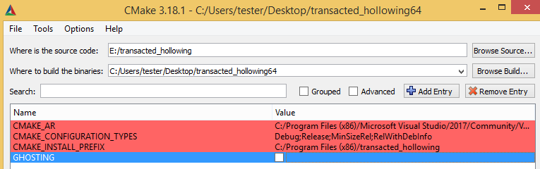
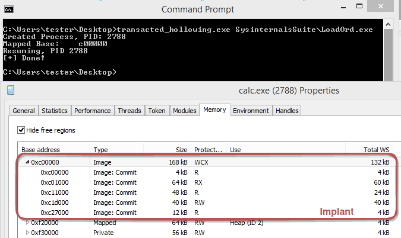

Transacted Hollowing
==========

[](https://ci.appveyor.com/project/hasherezade/transacted-hollowing)

Transacted Hollowing - a PE injection technique. A hybrid between [Process Hollowing](https://github.com/hasherezade/libpeconv/tree/master/run_pe) and [Process Doppelgänging](https://github.com/hasherezade/process_doppelganging). 


*More info [here](https://blog.malwarebytes.com/threat-analysis/2018/08/process-doppelganging-meets-process-hollowing_osiris/).*

---

"Ghostly" Hollowing - a similar technique, but using a delete-pending file instead of the transacted file. A hybrid between [Process Hollowing](https://github.com/hasherezade/libpeconv/tree/master/run_pe) and [Process Ghosting](https://github.com/hasherezade/process_ghosting). 


---

You can switch to build the second variant with the help of the CMake option: `GHOSTING`. By default, Transacted Hollowing is built.



---


Characteristics:
-

+ Payload mapped as `MEM_IMAGE` (unnamed: not linked to any file)
+ Sections mapped with original access rights (no `RWX`)
+ Payload connected to PEB as the main module
+ Remote injection supported (but only into a newly created process)



Supported injections:
-
If the loader was built as 32 bit:
```
32 bit payload -> 32 bit target
```
If the loader was built as 64 bit:
```
64 bit payload -> 64 bit target
32 bit payload -> 32 bit target
```

How to use the app:
-
Supply 2 commandline arguments:

```
[payload_path] [target_path]
```

Payload is the PE to be executed impersonating the Target.
